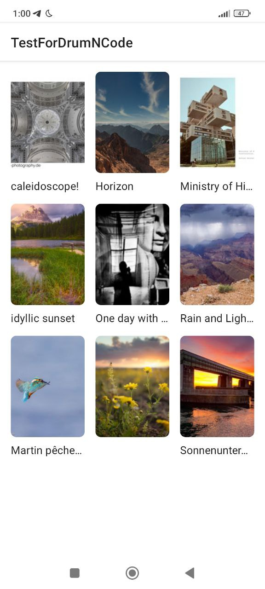
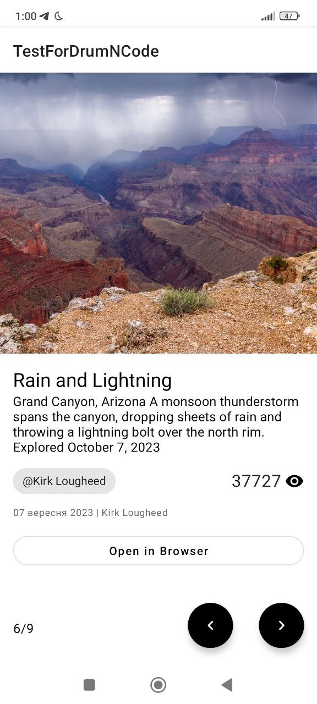
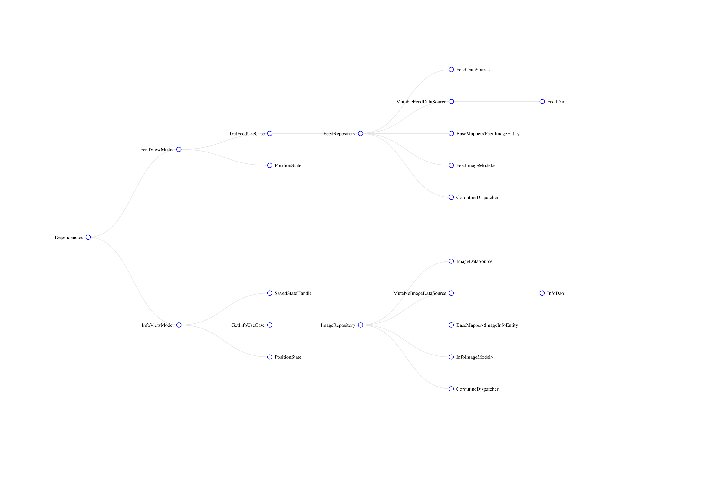

> [!NOTE]
> Невеличкий опис стеку та архітектури, неймінгу та пояснення по проєкту  
> [Завантажити apk](https://github.com/nexy791/TestTaskForDrumNCode/blob/master/images/app-debug.apk)
---

|   Головна    |    Інфо     |
| :-----| :-----: |
|  |  

## Константи
> в :app build.gradle за допомогою buildConfigField
> - BASE_URL
> - API_KEY
> - IMAGE_BASE_URL

---

## Стек:
- Kotlin
> Основна моя мова програмування
- Retrofit
> Gold Standart для створення Client-Server застосунків
- Moshi
> Gson працює на Java, Moshi має адаптер для Retrofit
- Room
> Wrapper під SQL, найкращий варіант для кешування великих даних 
- Coil
> Powered by Kotlin :D
- Kotlin coroutines; Flow
> Ідеальний та простий варіант  
> Зазвичай використовую LiveData, але відмовився через залежність до Android SDK
- Koin
> Для невеличкого проєкту через його простоту. Для великого проєкту звісно Hilt – через його роботу у compile

--- 

## Архітектура:
> MVVM та Clean

- :domain
> Вся бізнес-логіка: usecases, repo interfaces, base models
- :data
> Кешування та завантаження даних через remote або local sources; маппінг
- :common
> Різні допоміжні інструменти та base
- :app
> Presentation-Layer який ще виконує роль navigation та di  
> Не найкращий підхід, але і проєкт невеличкий 😅️️️️️️

- Граф:
> Згенерований автоматично, може містити помилки
>

  
